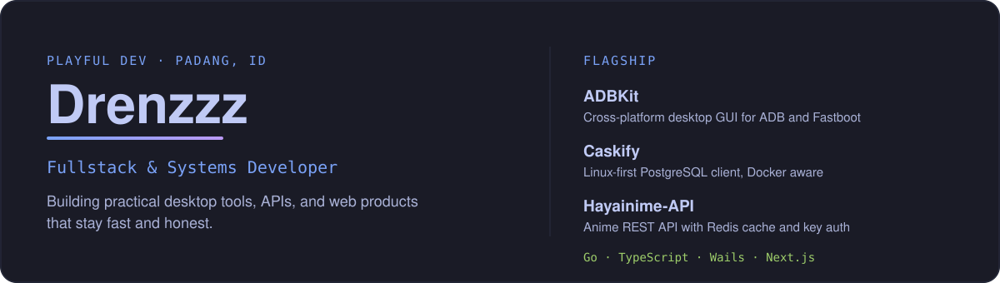
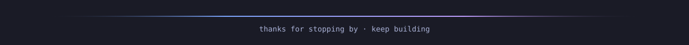

  

  
  
  
  

---

### About

I'm **Drenzzz**, a 21-year-old developer from Politeknik Negeri Padang.

I ship end-to-end: Go/Wails desktop apps, TypeScript/Next.js web, and Fiber/Hono APIs. Prefer things that are **fast, practical, and visually honest** — Linux-first when it matters.

| Focus | What I build |
|-------|----------------|
| **Web** | Fullstack apps with Next.js, Go, and modern backend tooling |
| **Desktop** | Native-feeling GUIs with Wails + React/TypeScript |
| **Systems** | Linux tooling, Android ROM workflows, virtualization experiments |

---

### Stack

  
  
  
  
  
  
  
  
  
  
  
  

---

### Featured work

| Project | What it does | Stack |
|---------|--------------|-------|
| [**ADBKit**](https://github.com/Drenzzz/ADBKit) | Modern ADB/Fastboot desktop GUI — cross-platform | TypeScript · Wails · React · Astro |
| [**Caskify**](https://github.com/CaskifyApp/Caskify) | Linux-first PostgreSQL client — keyring auth, query editor, Docker-aware | Go · Wails · React · TypeScript |
| [**Hayainime-API**](https://github.com/Drenzzz/Hayainime-API) | Otakudesu anime REST API — Redis cache + API key auth | Go · Fiber · Redis |
| [**ranoz-go**](https://github.com/Drenzzz/ranoz-go) | Ranoz.gg uploader CLI — streamed uploads, concurrent workers, JSON out | Go |
| [**mitra-wiradoor-sumbar**](https://github.com/Drenzzz/mitra-wiradoor-sumbar) | Client work — company profile & e-catalog for MR Konstruksi | TypeScript · Next.js |

---

### Activity

  

 

  

 

  <picture>
    <source media="(prefers-color-scheme: dark)" srcset="https://raw.githubusercontent.com/Drenzzz/Drenzzz/output/github-snake-dark.svg" />
    <source media="(prefers-color-scheme: light)" srcset="https://raw.githubusercontent.com/Drenzzz/Drenzzz/output/github-snake.svg" />
    
  </picture>

---

### Connect

  

  

