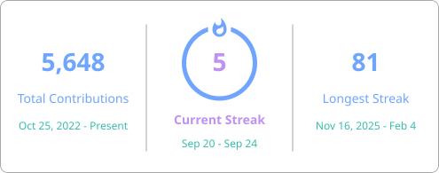

  

 

---

<h3 align="center">About Me</h3>

  

    I'm <strong>Drenzzz</strong>, a 21-year-old developer from Politeknik Negeri Padang. 
    I build things that are fast, practical, and visually honest.
  

  

    &bull; <strong>Web architecture</strong> — fullstack apps with Next.js, Go, and modern backend tooling 
    &bull; <strong>Desktop apps</strong> — native-feeling GUIs with Wails 
    &bull; <strong>System-level</strong> — Linux, Android ROM tooling, virtualization, and low-level experiments
  

 

---

<h3 align="center">Tech Stack</h3>

 

---

<h3 align="center">🚀 Featured Projects</h3>

| Project | What I Built | Stack |
|---------|-------------|-------|
| [**ADBKit**](https://github.com/Drenzzz/ADBKit) | A simple, modern GUI for ADB and Fastboot — cross-platform desktop app | TypeScript, Wails, React, Astro |
| [**Caskify**](https://github.com/CaskifyApp/Caskify) | Linux-first native PostgreSQL desktop client with keyring auth, query editor, and Docker/local DB detection | Go, Wails, React, TypeScript |
| [**Hayainime-API**](https://github.com/Drenzzz/Hayainime-API) | REST API scraping anime data from Otakudesu with Redis caching & API key auth | Go, Fiber, Redis |
| [**ranoz-go**](https://github.com/Drenzzz/ranoz-go) | CLI tool for uploading files to Ranoz.gg — streamed uploads, concurrent workers, JSON output | Go |
| [**mitra-wiradoor-sumbar**](https://github.com/Drenzzz/mitra-wiradoor-sumbar) | Client work — company profile & e-catalog site for MR Konstruksi | TypeScript, Next.js |

 

---

  

 

---

  

 

---

  <picture>
    <source media="(prefers-color-scheme: dark)" srcset="https://raw.githubusercontent.com/Drenzzz/Drenzzz/output/github-snake-dark.svg" />
    <source media="(prefers-color-scheme: light)" srcset="https://raw.githubusercontent.com/Drenzzz/Drenzzz/output/github-snake.svg" />
    
  </picture>

 

---

  

 

  

