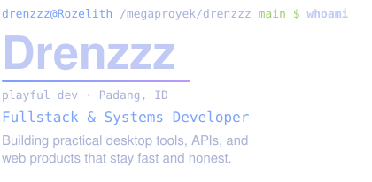

  <picture>
    <source media="(prefers-color-scheme: dark)" srcset="./assets/readme/hero.svg" />
    <source media="(prefers-color-scheme: light)" srcset="./assets/readme/hero-light.svg" />
    
  </picture>

  
  
  
  
  
  
  
  

---

### About

I'm **Drenzzz**, a software engineering student at Politeknik Negeri Padang. I build backend and fullstack software with Go, TypeScript, and JavaScript — web apps, REST APIs, desktop tools, and academic projects shipped through personal, open-source, and university work. Linux first when it matters.

For the web, I build fullstack apps with Next.js, Go, and modern backend tooling. For desktop, I build GUIs that feel native with Wails plus React and TypeScript. For systems, I work on Linux tooling, Android ROM workflows, and virtualization experiments.

---

### Stack

  

---

### Featured work

| Project                                                                       | What it does                                                                      | Stack                                         |
| ----------------------------------------------------------------------------- | --------------------------------------------------------------------------------- | --------------------------------------------- |
| [**ADBKit**](https://github.com/Drenzzz/ADBKit)                               | Cross-platform desktop client for Android device management (ADB and Fastboot)    | Go, Wails, React, TypeScript                  |
| [**Mitra Wiradoor Sumbar**](https://github.com/Drenzzz/mitra-wiradoor-sumbar) | Company profile and e-catalog: storefront, CMS, inquiry, guest checkout, and RBAC | Next.js, React, TypeScript, PostgreSQL        |
| [**Hayainime API**](https://github.com/Drenzzz/Hayainime-API)                 | REST API for anime data: search, schedules, details, and streaming, with caching  | Go, Fiber, Colly, Redis                       |
| [**Techyst**](https://github.com/Ambanet-Corporation/techyst)                 | AI-assisted hardware diagnostic app for smartphone repair technicians             | Next.js, React, TypeScript                    |
| [**FoodQCheck**](https://github.com/Drenzzz/umkm-food-quality)                | Capstone: food-quality classification with a model, API backend, and mobile app   | Python, FastAPI, TensorFlow, React, Capacitor |

---

### Activity

<!-- Copy-paste in your Readme.md file -->

<a href="https://next.ossinsight.io/widgets/official/compose-user-dashboard-stats?user_id=116653610" target="_blank" style="display: block" align="center">
  <picture>
    <source media="(prefers-color-scheme: dark)" srcset="https://next.ossinsight.io/widgets/official/compose-user-dashboard-stats/thumbnail.png?user_id=116653610&image_size=auto&color_scheme=dark" width="771" height="auto">
    
  </picture>
</a>

<!-- Made with [OSS Insight](https://ossinsight.io/) -->

 

  

 

  

  <picture>
    <source media="(prefers-color-scheme: dark)" srcset="https://raw.githubusercontent.com/Drenzzz/Drenzzz/output/github-snake-dark.svg" />
    <source media="(prefers-color-scheme: light)" srcset="https://raw.githubusercontent.com/Drenzzz/Drenzzz/output/github-snake.svg" />
    
  </picture>

---

  

